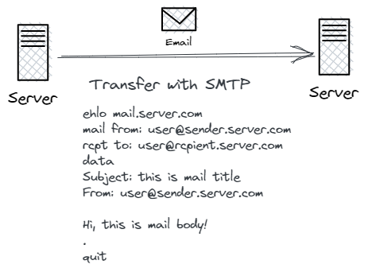
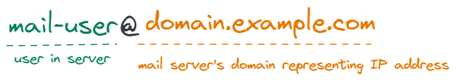
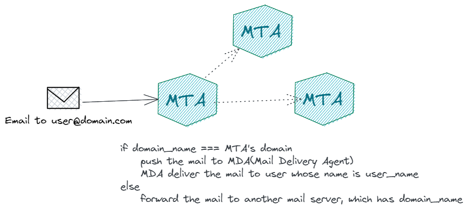
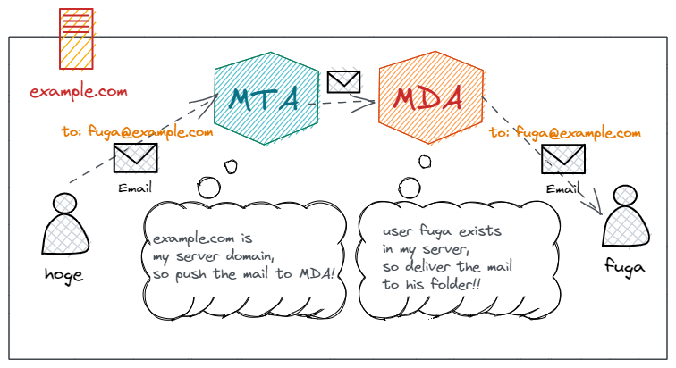
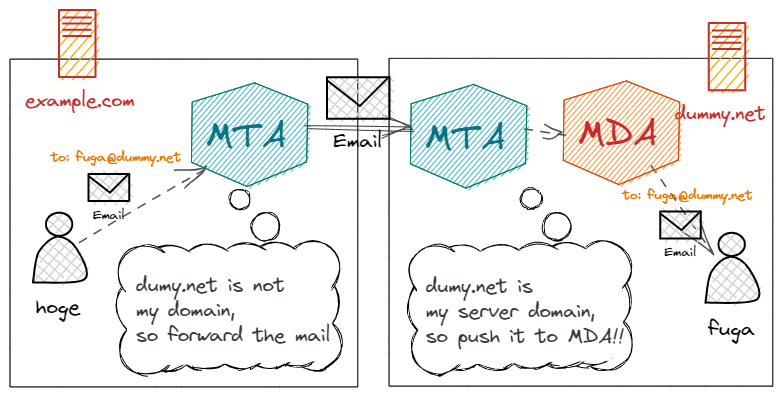

# メールの仕組みを概観する 1

メール技術について、基本的な最低限のことを話します。この章では、コードの説明やライブラリ依存のことをできるだけ出さずに、用語の位置づけなど、概念を理解してもらうように努めます。

## 最小限のメール

最も基本的なメールの機能は、メールサーバーのあるユーザーから、メールサーバーのあるユーザーへとメールを配送することです。

最初は、もっと単純に考えてみます。つまり、同じサーバー内の違うユーザー同士でメールのやり取りをする場合を想定します。
この最小限のメール配送を理解したうえで、だんだんと規模を大きくして、異なるサーバーでのやりとりや、ブラウザやメールソフトからメールを配送する方法を見ていきましょう。

### SMTP

いきなり英単語の略語が出てきてビビるかもしれませんが、ちょっと頑張ってください。
SMTP とは、Simple Mail Transfer Protocol の略で、メールの配送についての取り決めです。HTTP と同じように、プロトコルの一種ですね。このプロトコルによってメールアドレスの構成が決まっていたり、このプロトコルで定義された仕様に沿って MTA のソフトが開発されていたりします。
このプロトコルの職掌は、メールを相手のメールサーバーまで届ける方法を統一することです。



### メールアドレスの構成

最小限のメールに必要な道具その一です。
メールアドレスは、配送先を指定するものです。つまり、メアドの中には、配送先を特定するための情報が含まれています。メールの機能は、

> メールサーバーのあるユーザーから、メールサーバーのあるユーザーへとメールを配送すること

なので、より正確にいうと、どのサーバーに配送すればいいか、どのユーザーに配送すればいいか、という二つの情報が含まれているわけです。ちなみに、ユーザーとは、サーバー内でのユーザーのことを言います。
では、実物を確認していきます。
メールアドレスは、

```
user@domain.example.com
```

のような形式で表します。
@の前後で分割され、@より前はユーザー、@より後はドメインを表します。ドメインとは、DNS を介してサーバーの住所である IP アドレスを表すものです。



### サーバー同士のメールの送受信に必要な役割（MTA）

さて、メールアドレスによって配送先が分かるわけですが、実際にはそのメールアドレスを解析して、正常に処理を行うソフトが必要です。そのようなソフトを、MTA（Mail Transfer Agent）と呼びます。
MTA は、メアドを解析し、それに応じて適切な処理を行います。
具体的には、まずメールアドレスのドメインを見て、それが自分のサーバーかどうかを確認します。
もし自分のサーバーじゃなかったら、所定のプロトコルに従って配送先サーバーにメールを配送しようとします。一方で、もし自分のサーバー宛てのメールだった場合、ユーザー部分を確認して、そのユーザーのメールフォルダにメールを配送するように MDA（Mail Delivery Agent：メール配送エージェント）に指示を出します。

### ローカルでのメール配送に必要な役割（MDA）

前節で、MTA が自分のユーザー向けのメールを受け取ったときに、

> そのユーザーのメールフォルダにメールを配送するように MDA に指示を出します。

ということを書きました。その処理を担う役割が、MDA（Mail Delivery Agent：メール配送エージェント）あるいは LDA（Local Delivery Agent：ローカル配送エージェント）です。（[参考](https://e-words.jp/w/MTA.html)）
MDA は、MTA から渡されたメールを所定のフォルダに配送します。たとえば、宛先ユーザーのホームディレクトリなどです。
しかし、参考記事にも書かれている通り、初心者のうちはここを意識することは少ないと思います。MTA と MDA が一体になっていることが多いので。
MTA と MDA の責務を分けることによって、MDA に迷惑メールフィルタリングなどの機能をつけることが容易になります。


### 具体例で見てみる:サーバー内の異なるユーザーへのメール配送

必要な役者は揃いました。なので、サーバー内の異なるユーザーにメールを配送する手順を具体例で見てみましょう。自分の理解を確かめながら見てください。

`hoge@example.com`から`fuga@example.com`にメールを送ることを考えます。すると、以下のような流れになるはずです。

1. exapmle.com のサーバーの hoge ユーザーでサーバーにアクセスし、`fuga@example.com`にメールを送る指示を出す。（実際には、コマンドを打つなどして操作します）
2. 出された指示を `example.com` で動いている MTA が受け取る
3. MTA は、ドメイン部分を見て、`example.com` が自分自身であることを確かめる。
4. MTA は、ユーザー部分を見て、fuga ユーザーが自分のサーバーにいることを確かめる。
5. MTA は、MDA にメールを渡す
6. MDA は、fuga ユーザーの所定のフォルダに、メールを保存する。

大体の流れはこんな感じです。



### 具体例で見てみる:異なるサーバー間でのメール配送

この調子で最小限のメール配送に要素を一つ加えてみましょう。上の例では、同じサーバーの内部でメールのやり取りを行っていました。次は、サーバーをもう一台追加してみます。
新しく登場する役者はいないので、具体例から入ります。
`hoge@example.com` から `fuga@dummy.net` にメールを配送する事例を考えてみましょう。流れは以下のようになるはずです。

1. exapmle.com のサーバーの hoge ユーザーでサーバーにアクセスし、`fuga@example.com`にメールを送る指示を出す。（実際には、コマンドを打つなどして操作します）
2. 出された指示を `example.com` で動いている MTA が受け取る
3. MTA は、ドメイン部分を見て、`dummy.net` が自分自身ではないことを確かめる
4. `dummy.net` の MTA に向けて、メールを配送する
5. `example.com` から来たメールを `dummy.net` の MTA が受け取る
6. `dummy.net` の MTA は、ドメイン部分を見て、`dummy.net` が自分自身であることを確かめる。
7. MTA は、ユーザー部分を見て、fuga ユーザーが自分のサーバーにいることを確かめる。
8. MTA は、MDA にメールを渡す
9. MDA は、fuga ユーザーの所定のフォルダに、メールを保存する。

登場人物が一人増えただけですね。基本的にこの流れが分かっていれば、メール配送の最小限はわかっているといっても大丈夫でしょう。



### 注意してほしいところ

少し前提知識がある人向けに書きます。具体的には、POP3,IMAP,SMTP などの単語を聞いたことがある人向けです。
ネットで調べると、SMTP で送信し、POP3 や IMAP で受信するという単語が出てきます。これは誤解を招きやすい表現なので、この点に関しての補足です。

#### 誰が受信するのか（POP/IMAP）

> POP3 や IMAP で受信する

という言葉は、受信の主体がメールクライアントソフトです。メールクライアントソフトとは、ブラウザや個々人の PC で動作するメールソフト（outlook や roundcube など）のことです。

#### 誰が受信するのか（SMTP）

一方で、サーバーでメールを送受信するだけなら、SMTP を実装したソフトでも十分に可能です。（たとえば、postfix だけでメールのやり取りはできます）実際、昔は telnet などでサーバーに接続してコマンドを打ってメールの閲覧や編集、送信をしていたようです。
しかし、メールが一般に普及するにつれ、それは面倒だし大変だということでブラウザなどでもメールを見ることができるようにするために、IMAP などが策定されたようです。
つまり、IMAP や POP はサーバー上で受信したメールを手元のデバイスでも受信するためのプロトコルということです。一方で、サーバー上でメールを受信するだけなら、SMTP で十分です。
[参考記事](https://qiita.com/N-line/items/fe1e80497bef34d79443)を挙げておきます。

#### 概念的な役割とプロトコルの関係

なお、SMTP はメールサーバー間のメールのやり取り、IMAP/POP はメールサーバーとメールクライアントソフトとのやりとりを決めたものなので、MTA や MDA の具体的な動きを決めているわけではありません。それぞれ、少しだけ推奨とされる記述があるだけです。

- [SMTP:3.10. メーリングリストとエイリアス](http://srgia.com/docs/rfc2821j.html#3.10)
- [IMAP:5.1. メールボックスの名前付け](http://srgia.com/docs/rfc1730j.html#5.1)
