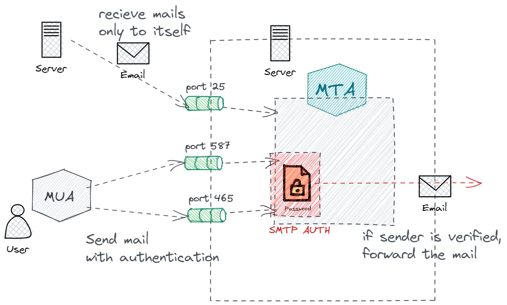
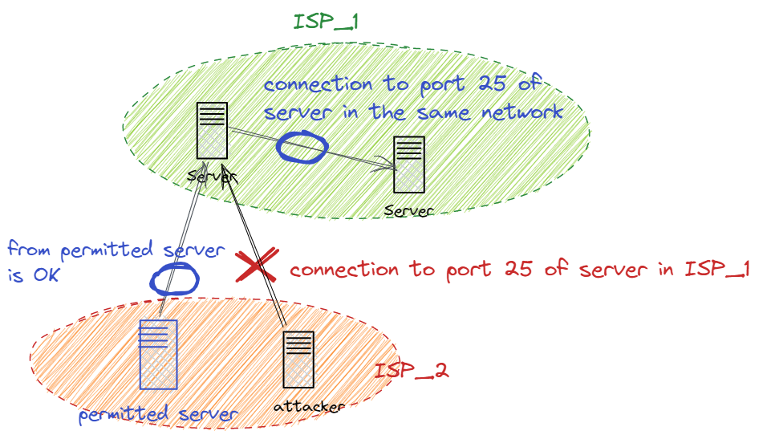

# メールの仕組みをセキュアにする技術

今までの話で、普段皆さんが使っているメールの流れは把握できたと思います。ただし、それは見かけ上の話です。
実際には、セキュリティ上のリスクが数多くあるので、それらの対策が裏側で行われています。次は、その対策について学んでいきます。
ここらへんからネット上の情報が少なくなってくるので、コミケなどで見つけた同人誌からの情報も参考にしつつ書いています。

## 守るべき場所

メール配送をするうえで、何に気を付ければいいのでしょうか。個人的には、以下の三種類に分けて考えるとわかりやすいと思います。

- 通信の内容を盗聴されないこと
- メールサーバーを乗っ取られないこと
- 相手のメールサーバーからフィルタリングをされないように身元確認用の情報設定をすること

それぞれの概略です。

### 通信内容を盗聴されないことについて

SMTP や POP/IMAP のプロトコルでは、全て平文で通信が行われます。そのため、しかるべき手段をとれば、第三者から通信内容が見れてしまうらしいです。
手段としては、HTTPS と同じように、SSL/TLS を使った暗号化を行います。

### メールサーバーを乗っ取られないことについて

主にスパムメールなどの踏み台にされることを、メールサーバーが乗っ取られると表現しています。
SMTP 単体には、ユーザー認証のしくみがありません。つまり、SMTP という書式に従って送られてきたメールはすべてそのまま配送してしまいます。
この仕様は、昔にメールを送るときに、宛先サーバーに直接届けられない場合は、近くのサーバーを経由してメールが届けられていたからです。悪用されることを想定していない、善意によって成り立つメールサーバーのネットワークです。
しかし、メールサーバーがだれでも利用できると、自分でサーバーを立てずに他人のメールサーバーから大量に悪意のあるメールをばらまく人や、送信元を偽ってフィッシング詐欺などのリンクを送り付けるということが起こり始めます。
そのため、現在では、メール送信者に対して、きちんと認証を求めるという対策を行う必要があります。

### 相手のメールサーバーからフィルタリングをされないように身元確認用の情報設定をすることについて

これは、自分自身のサーバーを守るため、というよりは、配送先のメールサーバーがセキュリティのために行っているフィルタリングを通してもらうためです。
メアドさえ公開されていれば、誰でも対象にメールが送れてしまうので、悪意のあるメールが多く届きます。そのため、きちんとしたメールサーバーでは、様々な方法を使って、迷惑メールを弾こうとします。
その方法の一つに、送信元に身元確認をするという方法があります。なので、送信元サーバーでは、身元確認のための情報をきちんと設定してあげることが必要です。

## 通信の内容を盗聴されないために

SSL/TLS を使います。以降は TLS という表記をします。

### TLS とは

最も身近なものが HTTPS でしょう。略さずに書くと HTTP over TLS です。実は HTTP だけでなく、TCP を使っている通信は、TLS による暗号化が可能です。
概略としては、ドメインに紐づく証明書と呼ばれるものを取得して、それを利用して通信を暗号化する処理をしているのが TLS です。

### 明示的/暗黙的な TLS

TLS を用いた暗号化通信を強制するかどうかです。
明示的な TLS は、通信相手と StartTLS というコマンドで、TLS をするかどうか相談をして、承諾をもらえてから TLS での通信を始めます。つまり、相手には拒否権があるわけです。明示的な TLS では、通常の通信と同じポートを使います。
一方で暗黙的な TLS は、最初から TLS での通信を行います。普通 TLS するよね？っていう暗黙的な了解があると考えるとわかりやすいです。暗黙的な TLS では、通常のポートとは別のポートを使います。
ここを分ける理由としては、TLS に対応していない通信があるからです。SMTP でサーバー間でメールを配送するときは、TLS 対応していないサーバーにも配送する可能性があるため、明示的な TLS を使うことが推奨です。

### SMTPS(SMTP over TLS)

SMTP では、well-known ポートとして 25 番が割り当てられています。明示的な TLS を使う場合は、25 番のままです。一方で、暗黙的な TLS を使う場合は、465 番を使います。

### IMAPs/POP3S(IMAP/POP3 over TLS)

明示的、暗黙的な TLS における、それぞれの使用ポートは、以下の通りです。

| プロトコル名 | 通常ポート | 暗黙的な TLS 使用時のポート |
| ------------ | ---------- | --------------------------- |
| POP          | 110        | 995                         |
| IMAP         | 143        | 993                         |

## メールサーバーを乗っ取られないために

主にスパムメールなどの踏み台にされることを、メールサーバーが乗っ取られると表現しています。
SMTP には、ユーザー認証の仕組みがないため、メールサーバーが不正に利用されてしまうということを説明しました。これから説明するのは、どのようにして外からの接続を調査して、関係ないユーザーからのメール送信を防ぐかです。

### SMTP-AUTH

クライアントがサーバーに接続するときに認証を行う仕組みです。認証には、SASL（Simple Authentication and Security Layer）というアプリケーションを使います。
SASL は、MTA とは独立したものとして置かれることが多く、POP や IMAP の認証とともに一括管理することができます。

### submission ポート

ただし、SMTP が使っている 25 番ポートで認証を行うわけではありません。25 番ポートで認証したら、普通の利用者が自分のサーバーにメールを送ったときにも認証を求めてしまいます。つまり、世界中の自分宛てにメールを送ってくるかもしれないサーバー全てにパスワードとかを教えておかなければいけないわけです。認証の意味がありませんね。
ということで、他のサーバーからメールを受けとる場所は 25 番のままですが、外部から来たメール送信の命令を受け取る場所を変える、という方法がとられています。
つまり、MUA からのメール送信命令専用の提出場所を作るわけです。そこを submission ポートと呼び、587 番ポートが利用されています。

### 全体の流れ

難しくなってきたので一度まとめましょう。
自分がメールを受け取るときは、通常通り 25 番ポートでメールをもらいます。ただし、それが他のサーバー宛てのメールだった場合は送りません。しかし、これでは自分が他のサーバー宛てに送信したメールも送信拒否されてしまいます。
そこで、submission ポートの出番です。587 番ポートにアクセスして、ユーザー名とパスワードを入力します。すると、SMTP-AUTH に従って、SASL が認証を行います。その認証に成功したら、相手の 25 番ポートに向けてメールを送信します。
これにて、認証を行いつつ、メールの送受信ができるようになりました。

### 465 番ポートと 587 番ポート

さて、SMTP-AUTH において、SMTPS を担っていた 465 番ポートの扱いはどうなるのでしょうか。
結論から言うと、465 番でも同じことができます。submission ポートの本質は、MUA からのメール送信専用のポートを作ることで、25 番ポートでメールを受け取る際には認証をかけずに済むことです。なので、受信に使う 25 番ポートと別であればなんでもいいのです。
ただし、違いもあります。465 番は暗黙的な TLS を利用しているので、通信が必ず TLS となります。一方で、587 番は明示的な TLS です。
このことについては、[Sendgrid の記事](https://sendgrid.kke.co.jp/blog/?p=12945)にまとまっているのですが、どうやら現在は明示的な TLS で汎用性が高いという点から、587 番ポートを使うことが推奨されているらしいです。

### その他の技術（OP25B・PbS）

メールサーバーを乗っ取られないための技術として調べていると、OP25B や PbS、RBL/S25R/グレイリスティングという単語が出てきます。
それぞれ簡潔に説明します。

#### OP25B

Outbound Port 25 Blocking の略です。名前の通り、ポート 25 から送信されるメールを禁止するものですが、個人のメールサーバーで設定するものではなく、プロバイダ側で設定するものらしいため、説明を省きました。
SMTP-AUTH の前提になっているものでもあるので、興味がある人は調べてみましょう。[この記事](https://masuipeo.com/tech/port587.html)が図もついていて、分かりやすそうです。

#### PbS

POP before SMTP の略です。SMTP をする前に、POP の認証機能を使って認証しようという仕組みです。重大な欠陥があったらしく、現在では使われていなさそうなので省きました。

#### RBL/S25R/グレイリスティング

略称の正式名称は、Realtime Blackhole List, Selective SMTP Rejection です。25 は、ポート 25 番で通信することから SMTP を表しています。
これら三つは、メールサーバーを乗っ取られないために、というよりも、スパムメールを自分のサーバーに送られないようにするために、という目的のものです。
今までの話だと、メールを受け取るためには 25 番ポートに送られてくるメールは、自分宛のメールであればすべて受け取る必要がありました。そのため、対象のドメインを持つメールサーバーに直接アクセスすることで、対象のドメイン宛てのスパムメールをいくらでも送ることができます。（他のメールサーバーから間接的に送られてくるスパムメールは、OP25B があるので考えないものとしています）
そのため、直接アクセスして送られてくるスパムメールを防ぐ方法として、RBL/S25R/グレイリスティングの三つがあります。
RBL は、スパムメールを送ってくる IP アドレスをリストとして持っておいて、その IP アドレスからの接続をブロックするというもの。この方法は、いかに正確で信頼できるブラックリストを持つかが重要です。無料のリストや有料のリストがあるらしいですが、どうしても偽情報が紛れ込むらしいです。
S25R は、ドメインの逆引き（IP アドレスからドメインを検索する）をして、逆引きしてきたドメイン情報を基にスパムメールかどうかを判断します。たとえば、逆引きしてもドメインが判明しない IP アドレスは接続を拒否するとかですね。メアドには必ずドメインが必要なので、ドメインを持っていないメールサーバーは怪しいという理論です。しかし、セキュリティ上の理由から、わざと逆引きレコードを設定しないという運用もあるらしいので、許可すべきものを許可しない（フォルスポジティブ＝偽判定に積極的）という可能性があります。
グレイリスティングは、S25R のフォルスポジティブの問題を解決し、より正確に判断できるものです。グレイリストは、疑わしいが接続を一時的に許可するという意味です。S25R に引っかかる IP アドレスがいた場合、一度接続を拒否します。しかし、SMTP の仕様では、何らかの理由で配送ができなかった場合に、5 分後に再送するという仕様があります。そのため、一度接続を拒否したアドレスから 5 分後に再度接続があった場合は、正常なメールサーバーであるとしてグレイリストに入れるという仕組みです。
メールサーバーを乗っ取られない、という文脈からは少し外れるのと、現在 A103 のサーバーではこれを利用していないので省きました。

## 相手のメールサーバーからフィルタリングをされないために

いわゆるスパムやマルウェアのメールは、送信元を偽装していることが多いです。企業などからの、信頼できるメールだと見せかけるということです。
このようなメールに対応するためには、そのメールを送ってきたのが本当に発信元のドメインを持つメールサーバーなのか、という判定が必要になります。
ちゃんとしたメールサーバーでは、この確認をしています。そのため、メールサーバーを自分で立てるときは、宛先サーバーのドメイン認証を通ることができるように設定しておかないと、迷惑メールと判断される可能性が高くなってしまいます。
以下では、設定が必要な三項目について解説します。

### 前提

メールのヘッダーに書かれた送信元メールアドレスは、自己申告制なので、いくらでも偽装できます。そのため、送信元メールアドレスだけで信頼度を測ることは不可能です。そのため、ドメインの所有者が、自分のドメインが送信元となっている場合に、本当に自分の管理下から送られたメールなのかを判定する方法を提供します。
ただし、ドメイン認証を使うかどうかは、相手側の判断に委ねられています。つまり、こちらからできることは、方法を提供し、推奨する対応を伝えることだけです。
また、ドメイン認証に関していえば、ドメインから判断しているだけなので、きちんとドメインを設定したうえで送られてきたスパムメールは防げません。

### SPF

Sender Policy Flamework の略です。DNS の txt レコードを利用し、自分のメールサーバーの IP アドレスを記述します。これによって、SPF に記述されていない IP アドレスから来たメールは怪しいよ、と伝えることができます。
しかし、これはメールが他のサーバーを経由してきた場合に、正確な判断ができません。また、外部サービスを利用している場合、送信元メールサーバーを SPF レコードに記述するのが難しい場合があります。

### DKIM

Domain Keys Identified Mail の略です。これは、送信元サーバー側で送信するメールに秘密鍵を使って電子署名をします。そして、公開鍵を DNS の txt レコードで公開しておいて、宛先サーバー側がその正当性を検証できるようにします。
デメリットとして、一つ一つのメールに署名するので、サーバーのリソースを喰うことがあるらしいです。

### DMARC

Dmain based Message Authentication Reporting & Conformange の略です。これは、SPF と DKIM の認証をもとにどのような対応をとることを推奨するか、ということを伝えるフレームワークです。また、受信側に SPF と DKIM の両方で認証失敗したメールの統計情報と、認証に失敗したメールの情報を送信する先を示します。ただし、受信側に強制するものではありません

### その他

迷惑メールを除外するために、様々な方法があります。そのうち有名なものは、IP レピュテーションです。
IP ごとに信頼度を算出して、迷惑メールかどうかを判断する仕組みですが、その算出方法はブラックボックスで、メールサーバー運用者側から打てる手は少ないです。A103 では、一度メールサーバーが乗っ取られてスパムメールを送った時に、この IP レピュテーションが低下して、苦しい思いをしたことがあります。
IP レピュテーションについての情報は、[メールというインターネットの闇と IP レピュテーション（だけど重要）(前編)](https://qiita.com/nfujita55a/items/5848fcfbbe6cbf7d98c3)によくまとまっています。
IP レピュテーションに関して、こちらからできることは、IP ウォームアップくらいなので、その他に突っ込みました。

## 参考文献

メールのセキュリティ事情とかになってくると、途端にネット上の情報が少なくなる気がします。多分、それぞれの仕組みの名前を知っていれば詳細な情報にアクセスしやすくなると思いますが、それらを体系的に学べるような記事に行き当たることが難しいです。そのため、ここに参考にしたものをまとめておきます。
なお、全て有料で、コミケとか技術書典を漁っていて見つけたものです。

- [【電子版】Dark Depths of SMTP](https://booth.pm/ja/items/1136808)
- [迷惑メール徹底対策](https://techbookfest.org/product/5084486165331968?productVariantID=6226749903863808)
- [メールセキュリティ概論第 2 版](https://www.melonbooks.co.jp/detail/detail.php?product_id=1188253)

このうち、メールセキュリティ概論第二版を参照しながら「安全なメールの配送概論」を書きました。
