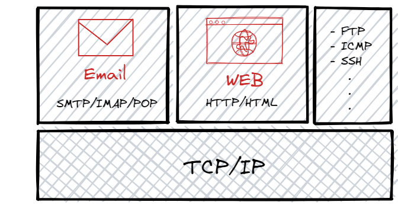

# メールという技術について

この章では、技術的なことではなく、雑学的なこと、思想的なことを話します。

## メールの特徴

特定の管理者がおらず、分散的な構成によって情報伝達システムを構築しているという点が特徴的でしょう。
これは、たとえば、特定の企業のアカウントを使うことで通信を実現しているチャットサービスなどとは違う点です。

一方で、管理者がいないゆえに、従来のセキュリティ対策が行えないというデメリットもあります。端的にいえば、あるメールサーバーがすべてのユーザーを知っているということがありえないため、認証などが行いにくいのです。結果として、スパムメールなどが問題になります。
このようなデメリットを、どのように緩和しているのか、というようなシステムの部分に着目するのも興味深いでしょう。

### メール今昔

昔の話から始めましょう。メールが登場した当初は、メールアドレスを持っている人も少なかったでしょう。
そのため、誰にでも送れるという利点ではなく、遠く離れた人と手軽にテキストコミュニケーションがとれるという点がもてはやされたはずです。

しかし、現在では SNS がその機能を担っています。そのため、メールの役割は別の部分に見出されていると思います。
その役割とは、比較的規模が大きいコミュニティにおいて、ユーザー側と連絡を取るためのツールというものです。企業などを考えるとわかりやすいですね。
今でも内部での連絡手段として使っている団体はあるでしょう。しかし、LINE や slack などの普及率を考えるとその割合もどんどん減っていくと思います。もちろん、LINE や slack がこの先ずっと使われていくとも思ってませんが。

皆さんのメールの使い方を考えても、個人間の連絡に使っている人は少ないはずです。それよりは、サービスへのログイン認証や、大学からの一斉送信などに使っている人が多いはずです。
これは、メールの「メアドさえ知っていれば誰にでも送れる」という特徴が珍重されているからだと思います。フォロー、フォロバなども必要ありませんし、相手にメアドを知られても、自分が他にやり取りしている相手を知られることはありません。

さらに、昔からある技術で、世界的に使われているので、ユーザー数が多いです。社会的な立場がある人であれば、ほぼ、誰にでも送れるといっても過言ではないでしょう。

一方で、誰にでも送れるという点がときにはデメリットとなることもあります。スパムとかですね。これにより、メールフィルターなどの技術が発展してくるのですが、それによるつらみもあります。後述する予定です。

### WEB とメールについて

何もわからないとここをごちゃごちゃにして考えてしまいがちです。実際、僕もメールについて学ぶ前は同じものだと考えていました。

両者は異なるものです。技術的な階層でいうと同じ階層に位置する兄弟みたいなものというイメージです。

WEB はトランスポート層において TCP/IP を使い、アプリケーション層で HTTP プロトコルを使って実現された技術で、HTML などをやりとりする技術です。
一方でメールは、トランスポート層において TCP/IP を使うという点は同じですが、アプリケーション層では SMTP と呼ばれるプロトコルを使っています。
別の言葉を使うと、インターネット上（つまり TCP/IP で繋がれたローカルエリアネットワークのネットワーク）で動いているサービスの種類として、WEB やメールが存在するということです。

### 枯れた技術

メール自体の仕組みは、いわゆる「枯れた技術」で、これから急激に変化する可能性は低いはずです。
現代のメールの核となる技術（SMTP）が開発されたのが、1980 年代だったのに対して、WEB の核となる技術（HTTP）が開発されたのが 1990 年代であることを見ても、どれくらい枯れた技術かがわかるでしょう。

## メールについての情報収集

メール今昔において触れましたが、大きな傾向としてメールの利用者が、個人から企業になってきています。また、メールを利用する個人側が各自でメールサーバーを立てるという事が少なくなり、Gmail や outlook といった企業が提供するメールサービスを利用することが多いです。

結果として、メールサービスを実際に運用したときの情報が各団体の内部で溜まり、一般向けに放出されにくい傾向にあります。
一般向けとは、インターネット上だけでなく、本なども含めてです。本屋にいっても「メール」というコーナーはありませんし、メールという技術単体についてまとめた本は、ここ 10 年くらい出ていないんじゃないでしょうか。
このような状況は、次の記事にも実感として書かれています。

メールというインターネットの闇と IP レピュテーション（だけど重要）(前編) - qiita
https://qiita.com/nfujita55a/items/5848fcfbbe6cbf7d98c3

執筆者の方は、おそらくメールシステムを運用する企業の中の人だと思いますが、ビジネス領域でメールの利用が多いことや、運用の知識の共有がされづらいことが書かれています。
私もメール運用の情報を集めるのに苦労したので、どのように情報を集めたかを一応書いておこうと思います。

### ドキュメント・RFC

一番信頼できるところです。
postfix, dovecot などが有名です。ただし、当たり前のことですが、メールの全体像ではなく、そのパッケージについての説明が主です。そのため、メールの全体像を知った人がどのようにパッケージを使うか、という観点では有用ですが、パッケージのドキュメントを使ってメールの全体像を把握することはなかなか難しいです。

#### RFC 5321: Simple Mail Transfer Protocol

https://www.rfc-editor.org/rfc/rfc5321

#### RFC 3501 - INTERNET MESSAGE ACCESS PROTOCOL - VERSION 4rev1

https://datatracker.ietf.org/doc/html/rfc3501

#### The Postfix Home Page

https://www.postfix.org/
なお、日本語ページもありますが、更新が止まっています。

#### Dovecot | The Secure IMAP server

https://www.dovecot.org/

### ブログ・ネット記事等

最も容易な情報収集です。エラー対応においては、最も効率的だと思います。特定のサービスに起因するバグなどの可能性もあるので。一方で、体系的に勉強するときには向かないです。特に、メールのセットアップについては、よく記事を選ばないと不十分な設定になってしまうことが多そうです。「メールを設定してみた」という記事を見ても、お前その設定だと送るメールが全部迷惑メールになるかもしれないぞ？っていうのが多いです。

### Twitter

メールに詳しそうな人を数人フォローしておくと色々と便利です。メール運用でのつらみや、最新の情報を流してくれます。たとえば、セキュリティでのアップデートが必要だとか、このメール関連の障害が起きていたとか。
フォローする人の選定としては、実際に過去に障害が起きたときに、その情報を流してくれていた人や、ブログ等にメールの情報を詳しくまとめてくれている人がいいと思います。

### 企業のブログ

メールサービスを提供している企業があって、そのようなテック系企業は技術系のブログを持っていることが多いです。SendGrid などがおすすめです。

https://sendgrid.kke.co.jp/blog/?cat=11

### 一般書

本屋や図書館にいっても、メール単体の本はおいてないです。探すとよいのは、ネットワーク技術についての棚で、そこの TCP/IP についてやネットワークセキュリティなどの分厚い本に、一章が割かれる感じで記述があることがあります。
実践的な知識を得ることができるわけではありませんが、正確な基礎知識を得られるでしょう。

更新が昔ですが、以下のような書籍紹介ページがあります。
http://www.postfix-jp.info/books.html

### 同人誌

コミケにいくと、実践経験豊富そうなおじさんがメールについての本を売っていることがあります。
また、Booth や技術書典といったところでも売ってるかもしれません。同人誌はサイクルが速く、またある程度腕に自信がある人しか出版しないので、正確で最新の情報が手に入ります。

メールセキュリティ概論第二版
https://www.melonbooks.co.jp/detail/detail.php?product_id=1188253

## メールの今後

メールを今後個人で使っていくことについて、思想を書きます。

### メールのつらみ

インフラ系の技術に詳しい人に、自前サーバーでメールを運用していることを伝えると、だいたいすぐに「やめたほうがいい」と言われます。
既に多くの企業で [sendgrid](https://sendgrid.kke.co.jp/) という、POST 通信を投げるだけであとはよしなにメールを配信してくれるサービスや、gmail などを独自ドメインで利用できる Gsuite というサービスを使っています。大学でも、Google などと提携しているところが多そうです。
AWS などのクラウドサービスも、メール送信サービスをもっています。

このように外部にメール送信を委託する理由としては、セキュリティの設定が難しいことや、IP レピュテーション（IP アドレス毎に紐づけられた信頼度で、迷惑メールなどの判断に使われる）の難しさなどがあります。

もし、個人でメールサーバーを運用することについて考えているなら、再考を促したいです。セキュリティのために、また将来のシステム管理者の負担軽減のために、できるだけ大手のサービスに運用を任せることが必要だと思います。もう小規模の団体が自前のメールサーバーを立てる時代は終わっています。
